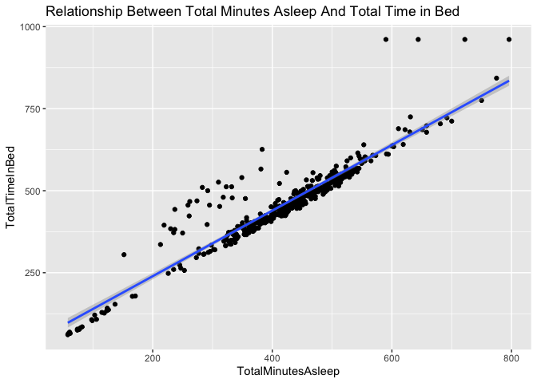
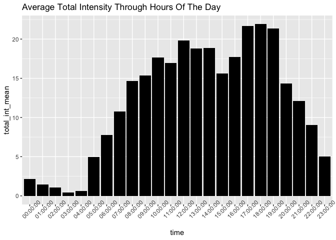
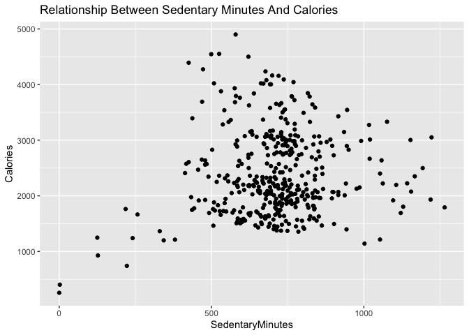
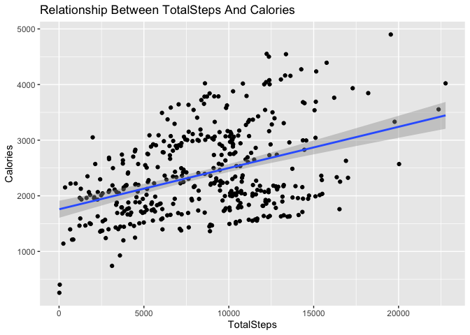

Bellabeat Project
================
### TABLE OF CONTENTS
- [Introduction](#introduction)
- [Cleaning](#cleaning)
- [Analysis](#analysis)
- [Summary](#summary)
- [Recommendations](#recommendations)
### INTRODUCTION

As a junior data analyst working on the marketing analyst team at Bellabeat, a high-tech manufacturer of health-focused products for women. Bellabeat is a successful small company, but they have the potential to become a larger player in the global smart device market. Urška Sršen, cofounder and Chief Creative Officer of Bellabeat, believes that analyzing smart device fitness data could help unlock new growth opportunities for the company. I have been asked to focus on one of Bellabeat’s products and analyze smart device data to gain insight into how consumers are using their smart devices. The insights I discover will then help guide marketing strategy for the company. These analysis will be presented to the Bellabeat executive team along with high-level recommendations for Bellabeat’s marketing strategy.

Products

- Bellabeat app: The Bellabeat app provides users with health data related to their activity, sleep, stress,
menstrual cycle, and mindfulness habits. This data can help users better understand their current habits and
make healthy decisions. The Bellabeat app connects to their line of smart wellness products.

- Leaf: Bellabeat’s classic wellness tracker can be worn as a bracelet, necklace, or clip. The Leaf tracker connects
to the Bellabeat app to track activity, sleep, and stress.

- Time: This wellness watch combines the timeless look of a classic timepiece with smart technology to track user
activity, sleep, and stress. The Time watch connects to the Bellabeat app to provide you with insights into your
daily wellness.

- Spring: This is a water bottle that tracks daily water intake using smart technology to ensure that you are
appropriately hydrated throughout the day. The Spring bottle connects to the Bellabeat app to track your
hydration levels.
○ Bellabeat membership: Bellabeat also offers a subscription-based membership program for users.
Membership gives users 24/7 access to fully personalized guidance on nutrition, activity, sleep, health and
beauty, and mindfulness based on their lifestyle and goals.

### CLEANING

The first step to take is to process the data from dirty to clean before analysis.
This was done using RStudio with the following steps below.


Loading packages for cleaning and visualizations

``` r
library(tidyverse)
```

    ## ── Attaching core tidyverse packages ──────────────────────── tidyverse 2.0.0 ──
    ## ✔ dplyr     1.1.4     ✔ readr     2.1.5
    ## ✔ forcats   1.0.0     ✔ stringr   1.5.1
    ## ✔ ggplot2   3.5.1     ✔ tibble    3.2.1
    ## ✔ lubridate 1.9.4     ✔ tidyr     1.3.1
    ## ✔ purrr     1.0.2     
    ## ── Conflicts ────────────────────────────────────────── tidyverse_conflicts() ──
    ## ✖ dplyr::filter() masks stats::filter()
    ## ✖ dplyr::lag()    masks stats::lag()
    ## ℹ Use the conflicted package (<http://conflicted.r-lib.org/>) to force all conflicts to become errors

``` r
library(readr)
```

Loading data files into R

``` r
activity <- read_csv("dailyActivity_merged.csv")
```

    ## Rows: 940 Columns: 15
    ## ── Column specification ────────────────────────────────────────────────────────
    ## Delimiter: ","
    ## chr  (1): ActivityDate
    ## dbl (14): Id, TotalSteps, TotalDistance, TrackerDistance, LoggedActivitiesDi...
    ## 
    ## ℹ Use `spec()` to retrieve the full column specification for this data.
    ## ℹ Specify the column types or set `show_col_types = FALSE` to quiet this message.

``` r
calories <- read_csv("hourlyCalories_merged.csv")
```

    ## Rows: 22099 Columns: 3
    ## ── Column specification ────────────────────────────────────────────────────────
    ## Delimiter: ","
    ## chr (1): ActivityHour
    ## dbl (2): Id, Calories
    ## 
    ## ℹ Use `spec()` to retrieve the full column specification for this data.
    ## ℹ Specify the column types or set `show_col_types = FALSE` to quiet this message.

``` r
intensities <- read_csv("hourlyIntensities_merged.csv")
```

    ## Rows: 22099 Columns: 4
    ## ── Column specification ────────────────────────────────────────────────────────
    ## Delimiter: ","
    ## chr (1): ActivityHour
    ## dbl (3): Id, TotalIntensity, AverageIntensity
    ## 
    ## ℹ Use `spec()` to retrieve the full column specification for this data.
    ## ℹ Specify the column types or set `show_col_types = FALSE` to quiet this message.

``` r
sleep <- read_csv("sleepDay_merged.csv")
```

    ## Rows: 413 Columns: 5
    ## ── Column specification ────────────────────────────────────────────────────────
    ## Delimiter: ","
    ## chr (1): SleepDay
    ## dbl (4): Id, TotalSleepRecords, TotalMinutesAsleep, TotalTimeInBed
    ## 
    ## ℹ Use `spec()` to retrieve the full column specification for this data.
    ## ℹ Specify the column types or set `show_col_types = FALSE` to quiet this message.

``` r
weight <- read_csv("weightLogInfo_merged.csv")
```

    ## Rows: 67 Columns: 8
    ## ── Column specification ────────────────────────────────────────────────────────
    ## Delimiter: ","
    ## chr (1): Date
    ## dbl (6): Id, WeightKg, WeightPounds, Fat, BMI, LogId
    ## lgl (1): IsManualReport
    ## 
    ## ℹ Use `spec()` to retrieve the full column specification for this data.
    ## ℹ Specify the column types or set `show_col_types = FALSE` to quiet this message.

Preview of dataframes

``` r
head(activity)
```

    ## # A tibble: 6 × 15
    ##           Id ActivityDate TotalSteps TotalDistance TrackerDistance
    ##        <dbl> <chr>             <dbl>         <dbl>           <dbl>
    ## 1 1503960366 4/12/2016         13162          8.5             8.5 
    ## 2 1503960366 4/13/2016         10735          6.97            6.97
    ## 3 1503960366 4/14/2016         10460          6.74            6.74
    ## 4 1503960366 4/15/2016          9762          6.28            6.28
    ## 5 1503960366 4/16/2016         12669          8.16            8.16
    ## 6 1503960366 4/17/2016          9705          6.48            6.48
    ## # ℹ 10 more variables: LoggedActivitiesDistance <dbl>,
    ## #   VeryActiveDistance <dbl>, ModeratelyActiveDistance <dbl>,
    ## #   LightActiveDistance <dbl>, SedentaryActiveDistance <dbl>,
    ## #   VeryActiveMinutes <dbl>, FairlyActiveMinutes <dbl>,
    ## #   LightlyActiveMinutes <dbl>, SedentaryMinutes <dbl>, Calories <dbl>

Viewing the sleep_day data.

``` r
head(sleep)
```

    ## # A tibble: 6 × 5
    ##           Id SleepDay        TotalSleepRecords TotalMinutesAsleep TotalTimeInBed
    ##        <dbl> <chr>                       <dbl>              <dbl>          <dbl>
    ## 1 1503960366 4/12/2016 12:0…                 1                327            346
    ## 2 1503960366 4/13/2016 12:0…                 2                384            407
    ## 3 1503960366 4/15/2016 12:0…                 1                412            442
    ## 4 1503960366 4/16/2016 12:0…                 2                340            367
    ## 5 1503960366 4/17/2016 12:0…                 1                700            712
    ## 6 1503960366 4/19/2016 12:0…                 1                304            320

Identifying all columns in the daily_activity data.

``` r
colnames(sleep)
```

    ## [1] "Id"                 "SleepDay"           "TotalSleepRecords" 
    ## [4] "TotalMinutesAsleep" "TotalTimeInBed"

``` r
head(calories)
```

    ## # A tibble: 6 × 3
    ##           Id ActivityHour          Calories
    ##        <dbl> <chr>                    <dbl>
    ## 1 1503960366 4/12/2016 12:00:00 AM       81
    ## 2 1503960366 4/12/2016 1:00:00 AM        61
    ## 3 1503960366 4/12/2016 2:00:00 AM        59
    ## 4 1503960366 4/12/2016 3:00:00 AM        47
    ## 5 1503960366 4/12/2016 4:00:00 AM        48
    ## 6 1503960366 4/12/2016 5:00:00 AM        48

``` r
head(intensities)
```

    ## # A tibble: 6 × 4
    ##           Id ActivityHour          TotalIntensity AverageIntensity
    ##        <dbl> <chr>                          <dbl>            <dbl>
    ## 1 1503960366 4/12/2016 12:00:00 AM             20            0.333
    ## 2 1503960366 4/12/2016 1:00:00 AM               8            0.133
    ## 3 1503960366 4/12/2016 2:00:00 AM               7            0.117
    ## 4 1503960366 4/12/2016 3:00:00 AM               0            0    
    ## 5 1503960366 4/12/2016 4:00:00 AM               0            0    
    ## 6 1503960366 4/12/2016 5:00:00 AM               0            0

``` r
head(weight)
```

    ## # A tibble: 6 × 8
    ##           Id Date       WeightKg WeightPounds   Fat   BMI IsManualReport   LogId
    ##        <dbl> <chr>         <dbl>        <dbl> <dbl> <dbl> <lgl>            <dbl>
    ## 1 1503960366 5/2/2016 …     52.6         116.    22  22.6 TRUE           1.46e12
    ## 2 1503960366 5/3/2016 …     52.6         116.    NA  22.6 TRUE           1.46e12
    ## 3 1927972279 4/13/2016…    134.          294.    NA  47.5 FALSE          1.46e12
    ## 4 2873212765 4/21/2016…     56.7         125.    NA  21.5 TRUE           1.46e12
    ## 5 2873212765 5/12/2016…     57.3         126.    NA  21.7 TRUE           1.46e12
    ## 6 4319703577 4/17/2016…     72.4         160.    25  27.5 TRUE           1.46e12

Checking data structure

``` r
str(activity)
```

    ## spc_tbl_ [940 × 15] (S3: spec_tbl_df/tbl_df/tbl/data.frame)
    ##  $ Id                      : num [1:940] 1.5e+09 1.5e+09 1.5e+09 1.5e+09 1.5e+09 ...
    ##  $ ActivityDate            : chr [1:940] "4/12/2016" "4/13/2016" "4/14/2016" "4/15/2016" ...
    ##  $ TotalSteps              : num [1:940] 13162 10735 10460 9762 12669 ...
    ##  $ TotalDistance           : num [1:940] 8.5 6.97 6.74 6.28 8.16 ...
    ##  $ TrackerDistance         : num [1:940] 8.5 6.97 6.74 6.28 8.16 ...
    ##  $ LoggedActivitiesDistance: num [1:940] 0 0 0 0 0 0 0 0 0 0 ...
    ##  $ VeryActiveDistance      : num [1:940] 1.88 1.57 2.44 2.14 2.71 ...
    ##  $ ModeratelyActiveDistance: num [1:940] 0.55 0.69 0.4 1.26 0.41 ...
    ##  $ LightActiveDistance     : num [1:940] 6.06 4.71 3.91 2.83 5.04 ...
    ##  $ SedentaryActiveDistance : num [1:940] 0 0 0 0 0 0 0 0 0 0 ...
    ##  $ VeryActiveMinutes       : num [1:940] 25 21 30 29 36 38 42 50 28 19 ...
    ##  $ FairlyActiveMinutes     : num [1:940] 13 19 11 34 10 20 16 31 12 8 ...
    ##  $ LightlyActiveMinutes    : num [1:940] 328 217 181 209 221 164 233 264 205 211 ...
    ##  $ SedentaryMinutes        : num [1:940] 728 776 1218 726 773 ...
    ##  $ Calories                : num [1:940] 1985 1797 1776 1745 1863 ...
    ##  - attr(*, "spec")=
    ##   .. cols(
    ##   ..   Id = col_double(),
    ##   ..   ActivityDate = col_character(),
    ##   ..   TotalSteps = col_double(),
    ##   ..   TotalDistance = col_double(),
    ##   ..   TrackerDistance = col_double(),
    ##   ..   LoggedActivitiesDistance = col_double(),
    ##   ..   VeryActiveDistance = col_double(),
    ##   ..   ModeratelyActiveDistance = col_double(),
    ##   ..   LightActiveDistance = col_double(),
    ##   ..   SedentaryActiveDistance = col_double(),
    ##   ..   VeryActiveMinutes = col_double(),
    ##   ..   FairlyActiveMinutes = col_double(),
    ##   ..   LightlyActiveMinutes = col_double(),
    ##   ..   SedentaryMinutes = col_double(),
    ##   ..   Calories = col_double()
    ##   .. )
    ##  - attr(*, "problems")=<externalptr>

``` r
str(sleep)
```

    ## spc_tbl_ [413 × 5] (S3: spec_tbl_df/tbl_df/tbl/data.frame)
    ##  $ Id                : num [1:413] 1.5e+09 1.5e+09 1.5e+09 1.5e+09 1.5e+09 ...
    ##  $ SleepDay          : chr [1:413] "4/12/2016 12:00:00 AM" "4/13/2016 12:00:00 AM" "4/15/2016 12:00:00 AM" "4/16/2016 12:00:00 AM" ...
    ##  $ TotalSleepRecords : num [1:413] 1 2 1 2 1 1 1 1 1 1 ...
    ##  $ TotalMinutesAsleep: num [1:413] 327 384 412 340 700 304 360 325 361 430 ...
    ##  $ TotalTimeInBed    : num [1:413] 346 407 442 367 712 320 377 364 384 449 ...
    ##  - attr(*, "spec")=
    ##   .. cols(
    ##   ..   Id = col_double(),
    ##   ..   SleepDay = col_character(),
    ##   ..   TotalSleepRecords = col_double(),
    ##   ..   TotalMinutesAsleep = col_double(),
    ##   ..   TotalTimeInBed = col_double()
    ##   .. )
    ##  - attr(*, "problems")=<externalptr>

``` r
str(calories)
```

    ## spc_tbl_ [22,099 × 3] (S3: spec_tbl_df/tbl_df/tbl/data.frame)
    ##  $ Id          : num [1:22099] 1.5e+09 1.5e+09 1.5e+09 1.5e+09 1.5e+09 ...
    ##  $ ActivityHour: chr [1:22099] "4/12/2016 12:00:00 AM" "4/12/2016 1:00:00 AM" "4/12/2016 2:00:00 AM" "4/12/2016 3:00:00 AM" ...
    ##  $ Calories    : num [1:22099] 81 61 59 47 48 48 48 47 68 141 ...
    ##  - attr(*, "spec")=
    ##   .. cols(
    ##   ..   Id = col_double(),
    ##   ..   ActivityHour = col_character(),
    ##   ..   Calories = col_double()
    ##   .. )
    ##  - attr(*, "problems")=<externalptr>

``` r
str(intensities)
```

    ## spc_tbl_ [22,099 × 4] (S3: spec_tbl_df/tbl_df/tbl/data.frame)
    ##  $ Id              : num [1:22099] 1.5e+09 1.5e+09 1.5e+09 1.5e+09 1.5e+09 ...
    ##  $ ActivityHour    : chr [1:22099] "4/12/2016 12:00:00 AM" "4/12/2016 1:00:00 AM" "4/12/2016 2:00:00 AM" "4/12/2016 3:00:00 AM" ...
    ##  $ TotalIntensity  : num [1:22099] 20 8 7 0 0 0 0 0 13 30 ...
    ##  $ AverageIntensity: num [1:22099] 0.333 0.133 0.117 0 0 ...
    ##  - attr(*, "spec")=
    ##   .. cols(
    ##   ..   Id = col_double(),
    ##   ..   ActivityHour = col_character(),
    ##   ..   TotalIntensity = col_double(),
    ##   ..   AverageIntensity = col_double()
    ##   .. )
    ##  - attr(*, "problems")=<externalptr>

``` r
str(weight)
```

    ## spc_tbl_ [67 × 8] (S3: spec_tbl_df/tbl_df/tbl/data.frame)
    ##  $ Id            : num [1:67] 1.50e+09 1.50e+09 1.93e+09 2.87e+09 2.87e+09 ...
    ##  $ Date          : chr [1:67] "5/2/2016 11:59:59 PM" "5/3/2016 11:59:59 PM" "4/13/2016 1:08:52 AM" "4/21/2016 11:59:59 PM" ...
    ##  $ WeightKg      : num [1:67] 52.6 52.6 133.5 56.7 57.3 ...
    ##  $ WeightPounds  : num [1:67] 116 116 294 125 126 ...
    ##  $ Fat           : num [1:67] 22 NA NA NA NA 25 NA NA NA NA ...
    ##  $ BMI           : num [1:67] 22.6 22.6 47.5 21.5 21.7 ...
    ##  $ IsManualReport: logi [1:67] TRUE TRUE FALSE TRUE TRUE TRUE ...
    ##  $ LogId         : num [1:67] 1.46e+12 1.46e+12 1.46e+12 1.46e+12 1.46e+12 ...
    ##  - attr(*, "spec")=
    ##   .. cols(
    ##   ..   Id = col_double(),
    ##   ..   Date = col_character(),
    ##   ..   WeightKg = col_double(),
    ##   ..   WeightPounds = col_double(),
    ##   ..   Fat = col_double(),
    ##   ..   BMI = col_double(),
    ##   ..   IsManualReport = col_logical(),
    ##   ..   LogId = col_double()
    ##   .. )
    ##  - attr(*, "problems")=<externalptr>

Checking for duplicate rows

``` r
nrow(activity[duplicated(activity),])
```

    ## [1] 0

``` r
nrow(sleep[duplicated(sleep),])
```

    ## [1] 3

``` r
nrow(weight[duplicated(weight),])
```

    ## [1] 0

``` r
nrow(calories[duplicated(calories),])
```

    ## [1] 0

``` r
nrow(intensities[duplicated(intensities),])
```

    ## [1] 0

Removing duplicate rows found in the sleep dataset

``` r
sleep <- unique(sleep)
nrow(sleep)
```

    ## [1] 410

Checking the number of unique participants available in each dataframe

``` r
n_distinct(activity$Id)
```

    ## [1] 33

``` r
n_distinct(sleep$Id)
```

    ## [1] 24

``` r
n_distinct(calories$Id)
```

    ## [1] 33

``` r
n_distinct(intensities$Id)
```

    ## [1] 33

``` r
n_distinct(weight$Id)
```

    ## [1] 8

Checking the number of observations available in each dataframe

``` r
nrow(activity)
```

    ## [1] 940

``` r
nrow(sleep)
```

    ## [1] 410

``` r
nrow(calories)
```

    ## [1] 22099

``` r
nrow(intensities)
```

    ## [1] 22099

``` r
nrow(weight)
```

    ## [1] 67

The following dataframes have the respective number of rows, activity -
940 rows, sleep - 410 rows, calories - 22099 rows, intensities - 22099
rows, and weight - 67 rows. There are only 8 participants in the weight
dataframe compared to the others, this number is not good enough for
analysis

Standardizing date and time formats for the following data frames

activity

``` r
activity$ActivityDate=as.POSIXct(activity$ActivityDate, format="%m/%d/%Y", tz=Sys.timezone())
activity$date <- format(activity$ActivityDate, format = "%m/%d/%y")
```

sleep

``` r
sleep$SleepDay=as.POSIXct(sleep$SleepDay, format="%m/%d/%Y %I:%M:%S %p", tz=Sys.timezone())
sleep$date <- format(sleep$SleepDay, format = "%m/%d/%y")
```

intensities

``` r
intensities$ActivityHour=as.POSIXct(intensities$ActivityHour, format="%m/%d/%Y %I:%M:%S %p", tz=Sys.timezone())
intensities$time <- format(intensities$ActivityHour, format = "%H:%M:%S")
intensities$date <- format(intensities$ActivityHour, format = "%m/%d/%y")
```

calories

``` r
calories$ActivityHour=as.POSIXct(calories$ActivityHour, format="%m/%d/%Y %I:%M:%S %p", tz=Sys.timezone())
calories$time <- format(calories$ActivityHour, format = "%H:%M:%S")
calories$date <- format(calories$ActivityHour, format = "%m/%d/%y")
```

A quick statistical summary of dataframes to gain some insights

``` r
activity %>%
  select(TotalSteps,
          TotalDistance,
          VeryActiveMinutes,
          FairlyActiveMinutes,
          LightlyActiveMinutes,
          Calories,
          SedentaryMinutes) %>%
  summary()
```

    ##    TotalSteps    TotalDistance    VeryActiveMinutes FairlyActiveMinutes
    ##  Min.   :    0   Min.   : 0.000   Min.   :  0.00    Min.   :  0.00     
    ##  1st Qu.: 3790   1st Qu.: 2.620   1st Qu.:  0.00    1st Qu.:  0.00     
    ##  Median : 7406   Median : 5.245   Median :  4.00    Median :  6.00     
    ##  Mean   : 7638   Mean   : 5.490   Mean   : 21.16    Mean   : 13.56     
    ##  3rd Qu.:10727   3rd Qu.: 7.713   3rd Qu.: 32.00    3rd Qu.: 19.00     
    ##  Max.   :36019   Max.   :28.030   Max.   :210.00    Max.   :143.00     
    ##  LightlyActiveMinutes    Calories    SedentaryMinutes
    ##  Min.   :  0.0        Min.   :   0   Min.   :   0.0  
    ##  1st Qu.:127.0        1st Qu.:1828   1st Qu.: 729.8  
    ##  Median :199.0        Median :2134   Median :1057.5  
    ##  Mean   :192.8        Mean   :2304   Mean   : 991.2  
    ##  3rd Qu.:264.0        3rd Qu.:2793   3rd Qu.:1229.5  
    ##  Max.   :518.0        Max.   :4900   Max.   :1440.0

``` r
sleep %>%
  select(TotalSleepRecords,
          TotalMinutesAsleep,
          TotalTimeInBed) %>%
  summary()
```

    ##  TotalSleepRecords TotalMinutesAsleep TotalTimeInBed 
    ##  Min.   :1.00      Min.   : 58.0      Min.   : 61.0  
    ##  1st Qu.:1.00      1st Qu.:361.0      1st Qu.:403.8  
    ##  Median :1.00      Median :432.5      Median :463.0  
    ##  Mean   :1.12      Mean   :419.2      Mean   :458.5  
    ##  3rd Qu.:1.00      3rd Qu.:490.0      3rd Qu.:526.0  
    ##  Max.   :3.00      Max.   :796.0      Max.   :961.0

``` r
intensities %>%
  select(TotalIntensity,
          AverageIntensity)%>%
  summary()
```

    ##  TotalIntensity   AverageIntensity
    ##  Min.   :  0.00   Min.   :0.0000  
    ##  1st Qu.:  0.00   1st Qu.:0.0000  
    ##  Median :  3.00   Median :0.0500  
    ##  Mean   : 12.04   Mean   :0.2006  
    ##  3rd Qu.: 16.00   3rd Qu.:0.2667  
    ##  Max.   :180.00   Max.   :3.0000

``` r
weight %>%
  select(WeightKg,
          WeightPounds,
          BMI)%>%
  summary()
```

    ##     WeightKg       WeightPounds        BMI       
    ##  Min.   : 52.60   Min.   :116.0   Min.   :21.45  
    ##  1st Qu.: 61.40   1st Qu.:135.4   1st Qu.:23.96  
    ##  Median : 62.50   Median :137.8   Median :24.39  
    ##  Mean   : 72.04   Mean   :158.8   Mean   :25.19  
    ##  3rd Qu.: 85.05   3rd Qu.:187.5   3rd Qu.:25.56  
    ##  Max.   :133.50   Max.   :294.3   Max.   :47.54


Merging data for analysis and visualization

``` r
activity_sleep <- merge(sleep, activity, by=c('Id', 'date'))
head(activity_sleep) 
```

    ##           Id     date   SleepDay TotalSleepRecords TotalMinutesAsleep
    ## 1 1503960366 04/12/16 2016-04-12                 1                327
    ## 2 1503960366 04/13/16 2016-04-13                 2                384
    ## 3 1503960366 04/15/16 2016-04-15                 1                412
    ## 4 1503960366 04/16/16 2016-04-16                 2                340
    ## 5 1503960366 04/17/16 2016-04-17                 1                700
    ## 6 1503960366 04/19/16 2016-04-19                 1                304
    ##   TotalTimeInBed ActivityDate TotalSteps TotalDistance TrackerDistance
    ## 1            346   2016-04-12      13162          8.50            8.50
    ## 2            407   2016-04-13      10735          6.97            6.97
    ## 3            442   2016-04-15       9762          6.28            6.28
    ## 4            367   2016-04-16      12669          8.16            8.16
    ## 5            712   2016-04-17       9705          6.48            6.48
    ## 6            320   2016-04-19      15506          9.88            9.88
    ##   LoggedActivitiesDistance VeryActiveDistance ModeratelyActiveDistance
    ## 1                        0               1.88                     0.55
    ## 2                        0               1.57                     0.69
    ## 3                        0               2.14                     1.26
    ## 4                        0               2.71                     0.41
    ## 5                        0               3.19                     0.78
    ## 6                        0               3.53                     1.32
    ##   LightActiveDistance SedentaryActiveDistance VeryActiveMinutes
    ## 1                6.06                       0                25
    ## 2                4.71                       0                21
    ## 3                2.83                       0                29
    ## 4                5.04                       0                36
    ## 5                2.51                       0                38
    ## 6                5.03                       0                50
    ##   FairlyActiveMinutes LightlyActiveMinutes SedentaryMinutes Calories
    ## 1                  13                  328              728     1985
    ## 2                  19                  217              776     1797
    ## 3                  34                  209              726     1745
    ## 4                  10                  221              773     1863
    ## 5                  20                  164              539     1728
    ## 6                  31                  264              775     2035

### ANALYSIS

A visual representation of the data will provide better insights to participants habits
for better analysis. I will start by identifying the relationship between the total minutes 
asleep and the total time in bed.

``` r
ggplot(data=sleep, aes(x=TotalMinutesAsleep, y=TotalTimeInBed)) + 
  geom_point() + 
  geom_smooth(method = lm) +
  labs(title="Relationship Between Total Minutes Asleep And Total Time in Bed")
```

    ## `geom_smooth()` using formula = 'y ~ x'

<!-- -->

The scatterplot above shows a strong linear relationship between total minutes asleep
and total time in bed. Most data points are on the line, with a few outliers outside
the trend line. The upward trend pattern implies that the longer the sleep, the more 
time in bed.

``` r
intensities2 <- intensities %>%
  group_by(time) %>%
  summarise(total_int_mean = mean(TotalIntensity))
```

A visualization to understand participants intensity habits through the
day

``` r
ggplot(data=intensities2, aes(x=time, y=total_int_mean)) + geom_histogram(stat = "identity", fill='black') +
  theme(axis.text.x = element_text(angle = 45)) +
  labs(title="Average Total Intensity Through Hours Of The Day")
```

    ## Warning in geom_histogram(stat = "identity", fill = "black"): Ignoring unknown
    ## parameters: `binwidth`, `bins`, and `pad`

<!-- -->

The above bar plot shows that the hours of 5pm to 7pm is when the most
activity occurs. This may suggest that earlier times of less activity
may be due to working hours preventing much activity for earlier parts
of the day.

Relationship between sedentary minutes and calories

``` r
ggplot(data=activity_sleep, aes(x=SedentaryMinutes, y=Calories)) + 
  geom_point() + 
  labs(title="Relationship Between Sedentary Minutes And Calories")
```

<!-- -->

There appears to be no relationship between both variables as the data
points have no pattern. This can be a space Bellabeat can leverage on by
suggesting/introducing healthy lifestyles to users.Bellabeat can
leverage on this by having user devices record long sedentary habits and
encourage users to be active as long sedentary periods could lead
to health problems.

Relationship between total steps and calories

``` r
ggplot(data=activity_sleep, aes(x=TotalSteps, y=Calories)) + 
  geom_point() + 
  geom_smooth(method = lm) +
  labs(title="Relationship Between TotalSteps And Calories")
```

    ## `geom_smooth()` using formula = 'y ~ x'

<!-- -->

There appers to be a positive corroletion. Data points have an upward
trend which confirms positive relationship between Total steps and
calories. This suggest that the more steps participants make, the more
calories they burn. This can be used to inform users of their health
achievements thereby increasing device engagement.


### SUMMARY

From the above statiscal summary, the data informs me that on avergae, 
participants are less active, as the most hours of inactivity were recorded. 
We can see that the recording of lightly active minutes 
on average (mean) amounts to 3hrs, and sedentary minutes amount to 16hrs, 
this is a very long period of inactivity. Investigating intensity habits through 
the day revealed why this is so. On the other hand, for sleep summary, on average 
a participant slept for 7hrs at one time. This is not healthy as this falls short 
of what is required every night.

### RECOMMENDATIONS

###### Recommendations based on the above insights to improve bellabeat app 

1.  Introduction of daily goals will encourage app engagement.

2.  App notifications and reminders will inform users of their health
    and also introduce healthy habits.

3.  Also, an easy app interface will result in userfriendliness and
    increase customer retention.
